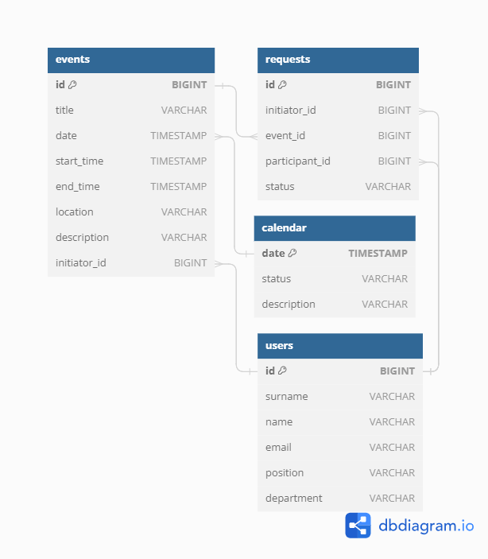

# Work calendar
_В рамках тестового задания реализовано приложение, представляющее из себя рабочий календарь сотрудника, 
в котором реализованы следующие возможности:
возможность добавления рабочих событий на временные промежутки в течении дня, 
возможность добавления отпусков и больничных по дням в течении месяца, 
подсчёт рабочего времени сотрудника в течении месяца
(т.е 8-часовой рабочий день в течении всех рабочих дней в месяце за исключением отпусков и больничных).
Приложение работает для декабря 2024. Для работы с другими месяцами необходимо загрузить данные по ним._

## Используемые технологии:
* Java 11
* REST API
* Spring Boot
* Maven
* Docker
* PostgreSQL
* JPA, Hibernate
* JUnit
* Mockito
* Lombok
* Postman

## API oсновного сервиса состоит из 2-х частей:
1. Приватная (доступна только для авторизированных пользователей)
* API для работы с календарём
* API для работы с событиями
* API для работы с запросами
* API для работы с пользователями
2. Административная (доступна только для администраторов сервиса)
* API для работы с пользователями

## [Postman тесты:](https://github.com/ValentinaBuddha/java-workcalendar/blob/main/postman/workcalendar.postman_collection.json)  

## Модель базы данных

## Иструкция по развертыванию
* mvn clean package
* mvn install
* docker-compose build
* docker-compose up -d

## Планы по доработке проекта:
* добавить авторизацию пользоветеля
* добавить проверку непересечения событий, если участник подтверждает событие

